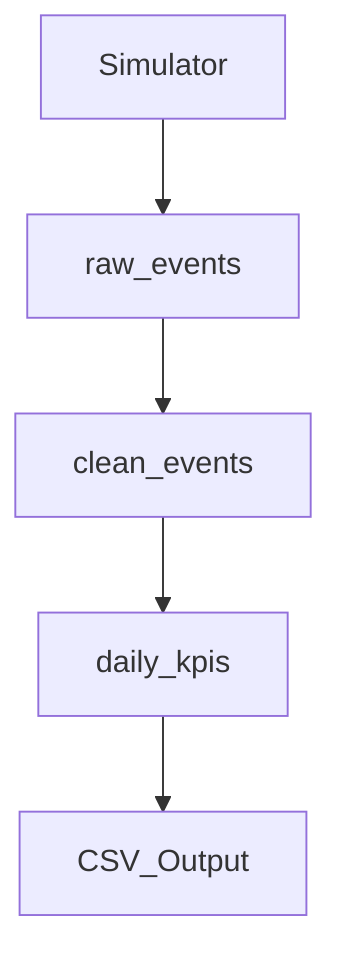

# Vehicle Telemetry Data Pipeline

The pipeline ingests raw events, cleans and validates them, computes daily KPIs, and exports a deterministic CSV report.

The system is designed to be **idempotent** and **environment-independent**.

---

## Architecture



- Raw data is preserved for traceability
- Clean data is validated before aggregation
- Daily KPIs are recomputed on each pipeline run and upserted (one row per day)

---

## Pipeline Steps

1. **Simulator** generates continuous vehicle events
2. **Cleaner** filters invalid data
3. **KPI Job** computes daily aggregates
4. **Exporter** writes deterministic CSV output

---

## Configuration

Database credentials are provided via environment variables loaded from a `.env` file.  
No credentials are hard-coded.

---

## How to Run

1. Start PostgreSQL (via Docker)
2. Before running the pipeline, initialize the database schema:

```bash
psql -U <user> -d <database> -f db/schema.sql
```

3. Create a `.env` file
4. Run the simulator in a separate terminal
5. Run the pipeline:

```bash
python run_pipeline.py
```

---

## Key Design Choices

- Raw / clean data separation
- Idempotent KPI computation via upsert (one row per day)
- Single pipeline entry point
- CSV as system-agnostic output

---

## Technologies

- Python
- PostgreSQL
- Docker
- psycopg2
