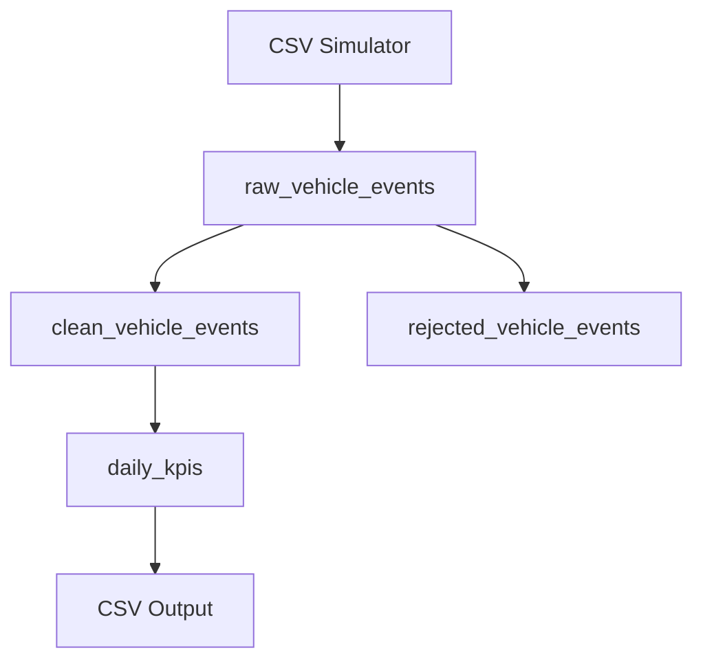

# Vehicle Telemetry Data Pipeline

This pipeline ingests vehicle events from a deterministic input source, validates and cleans them, computes daily KPIs, and exports a deterministic CSV report.

The system is designed to be **idempotent** and **environment-independent**.

---

## Architecture


```mermaid
flowchart TD
    Input[CSV Simulator] --> Raw[raw_vehicle_events]
    Raw --> Clean[clean_vehicle_events]
    Raw --> Rejected[rejected_vehicle_events]
    Clean --> KPIs[daily_kpis]
    KPIs --> CSV[CSV Output]
```

- Raw data is preserved for traceability (`raw_vehicle_events`)
- Invalid events are captured with reject reasons (`rejected_vehicle_events`)
- Clean data is validated before aggregation (`clean_vehicle_events`)
- Daily KPIs are recomputed on each run and **upserted** (one row per vehicle per day in `daily_kpis`)
- The ingest step injects periodic out-of-range values to demonstrate data quality enforcement

---

## Dataset

This project uses a **synthetically generated vehicle telemetry dataset** sourced from Kaggle for simulation purposes.  
The dataset is **not included** in this repository.

Download from:
https://www.kaggle.com/datasets/tejalaveti2306/vehicle-maintenance-telemetry-data

After downloading, place the CSV file here:

```
data/raw/synthetic_telemetry_data.csv
```

---

## Pipeline Steps

1. **Ingest** reads events from `data/raw/synthetic_telemetry_data.csv`
2. **Cleaner/Validator** routes events into:

   - `clean_vehicle_events` if valid
   - `rejected_vehicle_events` if invalid (with `reject_reason`)
   - all events are also stored in `raw_vehicle_events`

3. **KPI Job** computes daily aggregates from `clean_vehicle_events` into `daily_kpis`
4. **Exporter** writes deterministic CSV output from `daily_kpis`

---

## Idempotency & Determinism

- Event ingestion is deduplicated via UNIQUE constraints and `ON CONFLICT DO NOTHING`
- Daily KPIs are upserted per `(vehicle_id, kpi_date)`
- CSV output is deterministic via stable ordering

---

## Configuration

Database credentials are provided via environment variables loaded from a `.env` file.
No credentials are hard-coded.

Example `.env`:

```env
# Pipeline connection
DB_HOST=localhost
DB_NAME=database
DB_USER=user
DB_PASSWORD=1234.
DB_PORT=5432

# PostgreSQL Docker init
POSTGRES_DB=database
POSTGRES_USER=user
POSTGRES_PASSWORD=1234.
```

---

## How to Run

### 1) Start PostgreSQL (Docker)

```bash
docker compose up -d
```

> The database schema is initialized automatically on first startup via `db/schema.sql`.

To reset the database (dev only):

```bash
docker compose down -v
docker compose up -d
```

### 2) Install Python dependencies

```bash
python3 -m venv .venv
source .venv/bin/activate
pip install -r requirements.txt
```

### 3) Run the pipeline

```bash
python3 pipeline/run_pipeline.py
```

Output:

- CSV report: `output/daily_kpis.csv`

---

## Technologies

- Python
- PostgreSQL
- Docker / Docker Compose
- psycopg2
- pandas

## License

This project is licensed under the MIT License - see the [LICENSE](LICENSE) file for details.
